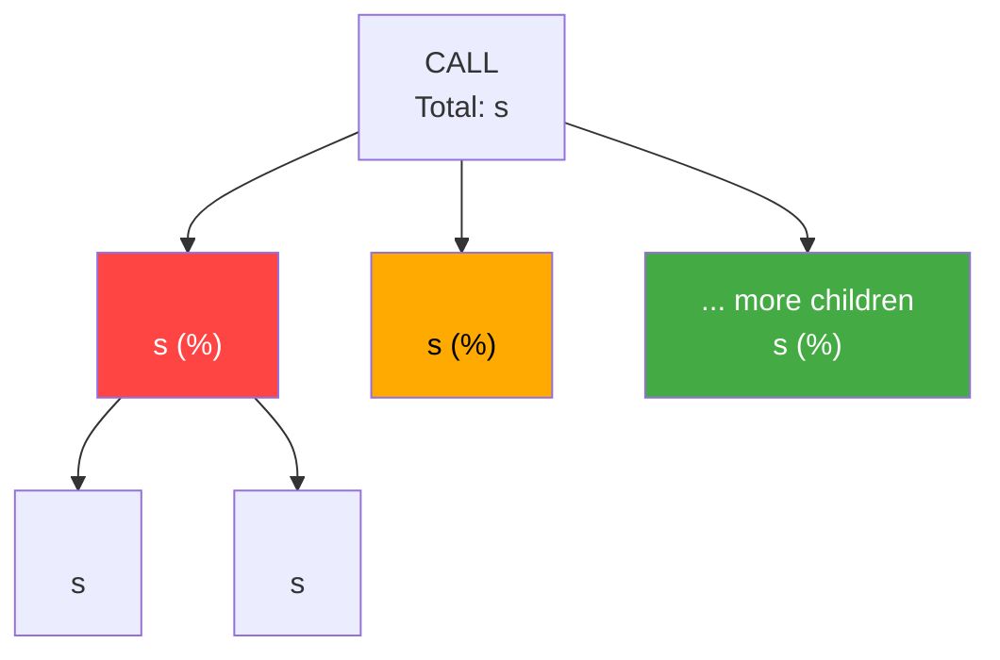

# Query Performance Deep-Dive

Starting from a single Query ID (or parameterized hash), drill through parent → child → grandchild statements to find the root cause bottleneck, classify the anti-pattern, and produce actionable recommendations with SQL implementation and unit tests.

## Prerequisites

- SNOWHOUSE access with SALES_ENGINEER role (or equivalent)
- SE_WH warehouse (or equivalent)
- A Query ID (UUID) or QUERY_PARAMETERIZED_HASH from the customer account
- Customer account locator

**Load** `references/snowhouse-queries.md` for all query templates.

## Workflow

```
Step 1: Resolve Account
  ↓
Step 2: Profile the Query (parent level) + 30-Day Trending
  ↓
Step 3: Drill into Children + Warehouse Sizing Check
  ↓  ├─→ If child is a CALL → Step 4 (recursive drill)
  ↓  └─→ If child is DML  → Step 5 (classify anti-pattern)
  ↓
Step 4: Recursive Nested SP Drill-Down + Execution Tree
  ↓
Step 5: Classify Anti-Pattern & Root Cause (with Confidence Scores)
  ↓
Step 6: Check Column Datatypes (for cluster key recs)
  ↓
Step 7: Write Deliverables (Recommendations + SQL + Tests + Monitoring)
```

### Step 1: Resolve Account

**Goal:** Get account_id and deployment from locator.

```sql
USE WAREHOUSE SE_WH;
SELECT ID AS ACCOUNT_ID, NAME AS LOCATOR, DEPLOYMENT
FROM SNOWHOUSE_IMPORT.PROD.ACCOUNT_ETL_V
WHERE NAME = '<LOCATOR>';
```

Save `ACCOUNT_ID` and `DEPLOYMENT`. All subsequent queries use these.

### Step 2: Profile the Query (Parent Level)

**Goal:** Get the parent query's metadata, execution stats, and 30-day trend.

**If the user provides a UUID (Query ID):**
```sql
SELECT j.JOB_ID, j.UUID, j.DESCRIPTION,
       ROUND(j.TOTAL_DURATION / 1000.0, 1) AS DURATION_SEC,
       j.ERROR_CODE, j.WAREHOUSE_NAME,
       j.QUERY_PARAMETERIZED_HASH,
       j.CREATED_ON
FROM SNOWHOUSE_IMPORT_SHARE_DB.<DEPLOYMENT>.JOB_ETL_V j
WHERE j.ACCOUNT_ID = <ACCOUNT_ID>
  AND j.UUID = '<QUERY_ID>';
```

**If the user provides a parameterized hash:**
```sql
SELECT j.JOB_ID, j.UUID, j.DESCRIPTION,
       ROUND(j.TOTAL_DURATION / 1000.0, 1) AS DURATION_SEC,
       j.ERROR_CODE, j.WAREHOUSE_NAME,
       j.QUERY_PARAMETERIZED_HASH,
       j.CREATED_ON
FROM SNOWHOUSE_IMPORT_SHARE_DB.<DEPLOYMENT>.JOB_ETL_V j
WHERE j.ACCOUNT_ID = <ACCOUNT_ID>
  AND j.QUERY_PARAMETERIZED_HASH = '<HASH>'
  AND j.CREATED_ON >= DATEADD(day, -7, CURRENT_TIMESTAMP())
ORDER BY j.TOTAL_DURATION DESC LIMIT 5;
```

Pick the slowest (or a representative) execution. Save `JOB_ID`.

Also check recent execution pattern to understand variance and error rate:
```sql
SELECT
    DATE_TRUNC('day', j.CREATED_ON) AS DAY,
    COUNT(*) AS RUNS,
    SUM(CASE WHEN j.ERROR_CODE IS NOT NULL THEN 1 ELSE 0 END) AS ERRORS,
    ROUND(AVG(j.TOTAL_DURATION) / 60000, 1) AS AVG_MIN,
    ROUND(MAX(j.TOTAL_DURATION) / 60000, 1) AS MAX_MIN
FROM SNOWHOUSE_IMPORT_SHARE_DB.<DEPLOYMENT>.JOB_ETL_V j
WHERE j.ACCOUNT_ID = <ACCOUNT_ID>
  AND j.QUERY_PARAMETERIZED_HASH = '<HASH>'
  AND j.CREATED_ON >= DATEADD(day, -7, CURRENT_TIMESTAMP())
GROUP BY DAY ORDER BY DAY;
```

#### 30-Day Duration Trend (Enhancement: Trending)

Pull 30-day daily execution stats to show whether the query is degrading over time or was always slow. Include this in the output report as a "Duration Trend" section.

```sql
SELECT
    DATE_TRUNC('day', j.CREATED_ON) AS DAY,
    COUNT(*) AS RUNS,
    SUM(CASE WHEN j.ERROR_CODE IS NOT NULL THEN 1 ELSE 0 END) AS ERRORS,
    ROUND(AVG(j.TOTAL_DURATION) / 60000, 1) AS AVG_MIN,
    ROUND(MEDIAN(j.TOTAL_DURATION) / 60000, 1) AS MEDIAN_MIN,
    ROUND(MAX(j.TOTAL_DURATION) / 60000, 1) AS MAX_MIN,
    ROUND(PERCENTILE_CONT(0.95) WITHIN GROUP (ORDER BY j.TOTAL_DURATION) / 60000, 1) AS P95_MIN
FROM SNOWHOUSE_IMPORT_SHARE_DB.<DEPLOYMENT>.JOB_ETL_V j
WHERE j.ACCOUNT_ID = <ACCOUNT_ID>
  AND j.QUERY_PARAMETERIZED_HASH = '<HASH>'
  AND j.CREATED_ON >= DATEADD(day, -30, CURRENT_TIMESTAMP())
GROUP BY DAY ORDER BY DAY;
```

In the report, render this as a text-based sparkline or table. Flag the trend:
- **Degrading**: If latest-week avg > previous-week avg by >20%, flag as "DEGRADING — investigate data growth or plan changes"
- **Stable-slow**: If variance < 15% across 30 days, flag as "STABLE — structural issue, not transient"
- **Intermittent**: If max > 3× median, flag as "INTERMITTENT — check for resource contention or data skew"

**⚠️ STOPPING POINT**: Present the execution profile (runs, errors, avg/max duration, 30-day trend classification) and ask if user wants to drill into a specific execution or the slowest one.

### Step 3: Drill into Children

**Goal:** Find all child statements of the parent, rank by duration, and check warehouse sizing.

```sql
SELECT
    ROW_NUMBER() OVER (ORDER BY c.TOTAL_DURATION DESC) AS RN,
    LEFT(c.DESCRIPTION, 250) AS CHILD_SQL,
    ROUND(c.TOTAL_DURATION / 1000.0, 1) AS DURATION_SEC,
    ROUND(c.TOTAL_DURATION * 100.0 / SUM(c.TOTAL_DURATION) OVER (), 1) AS PCT,
    ROUND(c.STATS:stats:scanBytes::NUMBER / POWER(1024,3), 1) AS SCAN_GB,
    c.STATS:stats:numRowsInserted::NUMBER AS ROWS_INS,
    c.STATS:stats:numRowsUpdated::NUMBER AS ROWS_UPD,
    c.STATS:stats:numRowsDeleted::NUMBER AS ROWS_DEL,
    ROUND((NVL(c.STATS:stats:ioLocalTempWriteBytes::NUMBER,0) + NVL(c.STATS:stats:ioRemoteTempWriteBytes::NUMBER,0)) / POWER(1024,3), 1) AS SPILL_GB,
    c.STATS:stats:hashJoinNumberBroadcastDecisions::NUMBER AS BROADCASTS,
    c.QUERY_PARAMETERIZED_HASH AS HASH,
    c.JOB_ID
FROM SNOWHOUSE_IMPORT_SHARE_DB.<DEPLOYMENT>.JOB_ETL_V c
WHERE c.ACCOUNT_ID = <ACCOUNT_ID>
  AND c.PARENT_JOB_ID = <PARENT_JOB_ID>
ORDER BY c.TOTAL_DURATION DESC;
```

For each child, determine:
- **Is it a CALL?** (DESCRIPTION starts with `CALL`) → Go to Step 4 for recursive drill
- **Is it DML (INSERT/UPDATE/DELETE/CREATE/SELECT)?** → Go to Step 5 to classify

Focus on children that account for >10% of total runtime.

**⚠️ Temp table shadowing check:** Before interpreting any scan size, scan the full list of children for `CREATE TEMPORARY TABLE <name>` statements. If a subsequent child JOINs or scans a table with that same name, it is reading the **temp table**, not the permanent table — even if the permanent table is large. Do not recommend clustering or restructuring the permanent table based on scan metrics that actually reflect the temp table. Cross-reference: `CHILD_SQL ILIKE 'CREATE%TEMPORARY%TABLE%<name>%'` in the child list.

#### Warehouse Sizing Check (Enhancement: Spill Analysis)

After listing children, calculate aggregate spill and scan metrics to assess warehouse sizing:

```sql
SELECT
    ROUND(SUM(c.STATS:stats:scanBytes::NUMBER) / POWER(1024,3), 1) AS TOTAL_SCAN_GB,
    ROUND(SUM(c.STATS:stats:ioLocalTempWriteBytes::NUMBER) / POWER(1024,3), 1) AS LOCAL_SPILL_GB,
    ROUND(SUM(c.STATS:stats:ioRemoteTempWriteBytes::NUMBER) / POWER(1024,3), 1) AS REMOTE_SPILL_GB,
    ROUND(SUM(c.STATS:stats:outputBytes::NUMBER) / POWER(1024,3), 1) AS TOTAL_OUTPUT_GB,
    c.WAREHOUSE_NAME,
    COUNT(*) AS CHILD_COUNT
FROM SNOWHOUSE_IMPORT_SHARE_DB.<DEPLOYMENT>.JOB_ETL_V c
WHERE c.ACCOUNT_ID = <ACCOUNT_ID>
  AND c.PARENT_JOB_ID = <PARENT_JOB_ID>
GROUP BY c.WAREHOUSE_NAME;
```

**Spill assessment rules (local + remote combined = TOTAL_SPILL_GB):**
- **TOTAL_SPILL_GB > 0 AND TOTAL_SPILL_GB < TOTAL_SCAN_GB × 0.1**: Minor spill — likely not the bottleneck. Mention but don't prioritize.
- **TOTAL_SPILL_GB > TOTAL_SCAN_GB × 0.1 AND < TOTAL_SCAN_GB × 0.5**: Moderate spill — recommend warehouse size-up as a P2 alongside query fixes.
- **TOTAL_SPILL_GB > TOTAL_SCAN_GB × 0.5**: Heavy spill — warehouse is significantly undersized for this workload. Recommend size-up as P1.
- **REMOTE_SPILL_GB > 0**: Remote spill is significantly worse than local spill (network I/O). Even small remote spill warrants a size-up recommendation.
- **No spill**: Warehouse sizing is adequate for current workload.

Include the warehouse sizing recommendation in the report if spill is moderate or heavy. Note: Always fix the query anti-patterns first (they often eliminate spill), and only then consider size-up if spill persists.

**Warehouse size reference:** X-Small → Small → Medium → Large → X-Large → 2X-Large → 3X-Large → 4X-Large → 5X-Large → 6X-Large. Each step up doubles compute and doubles cost per hour. Recommend at most one size-up unless spill is extreme.

#### Execution Tree Diagram (Enhancement: Visual Tree)

After drilling into children (and grandchildren in Step 4), generate a **Mermaid execution tree** for the report. This gives customers an instant visual of where time is spent.

**Template:**
````markdown

````

**Rules for building the tree:**
- Show the parent as the root node
- Show top 5 children by duration as individual nodes
- Collapse remaining children into a single "... N more" node
- Color nodes by severity: red (>30% of total), orange (10-30%), green (<10%)
- If a child is a CALL that was drilled into (Step 4), show its top 3 grandchildren as sub-nodes
- For cursor loops (Pattern 1), show a single node labeled "LOOP: <N> iterations × <SQL> (<TOTAL_SEC>s)"
- Truncate SQL to 40 chars in node labels

### Step 4: Recursive Nested SP Drill-Down

**Goal:** When a child is itself a CALL to another SP, drill into its children.

Use the child's `JOB_ID` as the new parent:
```sql
SELECT
    LEFT(gc.DESCRIPTION, 250) AS GRANDCHILD_SQL,
    ROUND(gc.TOTAL_DURATION / 1000.0, 1) AS DURATION_SEC,
    ROUND(gc.STATS:stats:scanBytes::NUMBER / POWER(1024,3), 1) AS SCAN_GB,
    gc.STATS:stats:numRowsInserted::NUMBER AS ROWS_INS,
    gc.STATS:stats:numRowsUpdated::NUMBER AS ROWS_UPD,
    ROUND((NVL(gc.STATS:stats:ioLocalTempWriteBytes::NUMBER,0) + NVL(gc.STATS:stats:ioRemoteTempWriteBytes::NUMBER,0)) / POWER(1024,3), 1) AS SPILL_GB,
    gc.STATS:stats:hashJoinNumberBroadcastDecisions::NUMBER AS BROADCASTS,
    gc.QUERY_PARAMETERIZED_HASH AS HASH,
    gc.JOB_ID
FROM SNOWHOUSE_IMPORT_SHARE_DB.<DEPLOYMENT>.JOB_ETL_V gc
WHERE gc.ACCOUNT_ID = <ACCOUNT_ID>
  AND gc.PARENT_JOB_ID = <CHILD_JOB_ID>
ORDER BY gc.TOTAL_DURATION DESC;
```

**Repeat** if a grandchild is also a CALL. Can go 3-4 levels deep.

**Loop detection:** If you see hundreds/thousands of children with the same `QUERY_PARAMETERIZED_HASH`, each inserting 1 row, this is a **row-at-a-time cursor loop** (see Step 5, Pattern 1).

To confirm, aggregate by hash:
```sql
SELECT
    c.QUERY_PARAMETERIZED_HASH,
    COUNT(*) AS ITERATIONS,
    ROUND(SUM(c.TOTAL_DURATION) / 1000.0, 1) AS TOTAL_SEC,
    ROUND(SUM(c.STATS:stats:scanBytes::NUMBER) / POWER(1024,3), 1) AS TOTAL_SCAN_GB,
    SUM(c.STATS:stats:numRowsInserted::NUMBER) AS TOTAL_ROWS
FROM SNOWHOUSE_IMPORT_SHARE_DB.<DEPLOYMENT>.JOB_ETL_V c
WHERE c.ACCOUNT_ID = <ACCOUNT_ID>
  AND c.PARENT_JOB_ID = <PARENT_JOB_ID>
GROUP BY c.QUERY_PARAMETERIZED_HASH
ORDER BY TOTAL_SEC DESC;
```

After completing all drill-downs, build the Mermaid execution tree (see Step 3 template).

### Step 5: Classify Anti-Pattern & Root Cause

**Goal:** Match the bottleneck statement's metrics to a known anti-pattern. Assign a confidence score and risk rating to each finding.

**Load** `references/anti-patterns.md` for the full catalog with detection criteria.

**Quick classification guide:**

| Signal | Anti-Pattern | Fix |
|--------|-------------|-----|
| 1000+ children, same hash, 1 row each | **Row-at-a-time loop** | Replace with set-based INSERT/UPDATE |
| High broadcasts (>5), scan >> output rows | **Missing temp table stats** | Materialize intermediate result into a new temp table to force cardinality re-evaluation |
| Billions of rows inserted → immediate DISTINCT | **Join explosion / fan-out** | Staged dedup joins with early DISTINCT |
| 10-30 UPDATEs on same table, different columns | **Serial UPDATE chain** | Merge into fewer UPDATEs with LEFT JOINs or pivoted MAX(CASE WHEN) |
| DELETE scans full table on large table | **CDC DELETE on unclustered table** | Cluster on DELETE predicate column |
| Many independent statements running serially | **Serial execution** | Parallelize with Tasks or async |
| 12 identical CALLs differing only by filter | **Repeated identical join** | Pivoted single-pass UPDATE |
| MERGE scans full target table, low partition pruning ratio | **MERGE on unclustered target** | Cluster target on MERGE ON-clause filter column |

**Additional checks when temp tables are present:**
- For each `CREATE TEMPORARY TABLE <name>` in the SP, verify the name does not collide with a permanent table or view in the same schema (see Pattern 9 in `references/anti-patterns.md`). Ask the customer to run the `information_schema.tables` check provided there.

**Additional checks for MERGE statements:**
- Calculate **partition pruning ratio**: `numPartitionsScanned / numPartitionsTotal`. A ratio near 1.0 means no pruning is occurring — strong signal for clustering.
- Check for **nondeterminism risk**: If the MERGE source can produce duplicate keys matching the same target row, the customer should use `ROW_NUMBER() ... QUALIFY` deduplication in the source subquery or set `ERROR_ON_NONDETERMINISTIC_MERGE = FALSE`. Flag this if the source is a stream or staging table without explicit dedup.

For each bottleneck:
1. State the anti-pattern name
2. Show the specific metrics that confirm it
3. Quantify the waste (e.g., "132B rows materialized, only 8,747 needed")
4. Calculate the fan-out ratio if applicable

#### Confidence Score (Enhancement)

Assign a confidence level to each finding based on the strength of evidence:

| Confidence | Criteria | Label |
|------------|----------|-------|
| **High** | Multiple confirming signals, large sample (>50 iterations, >5 broadcasts, fan-out >100:1) | "HIGH — confirmed by <metric>" |
| **Medium** | Single strong signal or small sample (5-50 iterations, 2-5 broadcasts) | "MEDIUM — likely, verify with <suggestion>" |
| **Low** | Indirect signal, may be transient (single occurrence, borderline thresholds) | "LOW — possible, needs more data" |

Include the confidence score next to each finding in the report.

#### Risk Rating (Enhancement)

Assign a risk level to each recommendation's implementation:

| Risk | Definition | Label |
|------|-----------|-------|
| **Safe** | Read-only or additive change, no logic modification (e.g., adding cluster key) | "SAFE — no logic change, can apply immediately" |
| **Low** | Minor logic change, equivalent behavior guaranteed (e.g., combining 2 UPDATEs into 1 with same WHERE) | "LOW RISK — equivalent logic, verify with unit tests" |
| **Moderate** | Structural logic change, behavior should be equivalent but needs validation (e.g., replacing loop with set-based, rewriting JOINs) | "MODERATE RISK — logic change, requires testing cycle" |

Include the risk rating next to each recommendation.

#### Severity Badges (Enhancement: Traffic-Light)

When presenting findings (both in conversation and in the report), prefix each with a severity badge:

- `[CRITICAL]` — P0, >50% of runtime, immediate action needed
- `[WARNING]` — P1, 10-50% of runtime, should fix in next release
- `[INFO]` — P2, <10% of runtime, optimize when convenient

**⚠️ STOPPING POINT**: Present root cause findings with confidence scores, risk ratings, and severity badges. Confirm before writing deliverables.

### Step 6: Check Column Datatypes

**Goal:** Before recommending cluster keys, verify column types to determine truncation needs.

```sql
SELECT t.NAME AS TABLE_NAME, tc.NAME AS COL_NAME, tc.DATA_TYPE_ENCODED
FROM SNOWHOUSE_IMPORT_SHARE_DB.<DEPLOYMENT>.TABLE_COLUMN_ETL_V tc
JOIN SNOWHOUSE_IMPORT_SHARE_DB.<DEPLOYMENT>.TABLE_ETL_V t
  ON tc.PARENT_ID = t.ID AND t.ACCOUNT_ID = <ACCOUNT_ID>
JOIN SNOWHOUSE_IMPORT_SHARE_DB.<DEPLOYMENT>.SCHEMA_ETL_V s
  ON t.PARENT_ID = s.ID AND s.ACCOUNT_ID = <ACCOUNT_ID>
JOIN SNOWHOUSE_IMPORT_SHARE_DB.<DEPLOYMENT>.DATABASE_ETL_V d
  ON s.PARENT_ID = d.ID AND d.ACCOUNT_ID = <ACCOUNT_ID>
WHERE d.NAME = '<DATABASE>' AND s.NAME = '<SCHEMA>'
  AND t.NAME = '<TABLE>'
  AND tc.NAME IN ('<COL1>', '<COL2>');
```

**Truncation rules (DATA_TYPE_ENCODED is VARCHAR containing JSON):**
- `"type":"TIMESTAMP_NTZ"` or `"type":"TIMESTAMP_LTZ"` or `"type":"TIMESTAMP_TZ"` → cluster key needs `TO_DATE(col)` to reduce cardinality
- `"type":"DATE"` → no truncation needed
- `"type":"FIXED"` → integer, no truncation needed
- `"type":"TEXT"` (high cardinality, e.g. UUIDs) → consider `SUBSTRING(col, 1, 5)` since Snowflake only tracks the first 5 bytes for VARCHAR clustering

**Clustering key best practices (from Snowflake docs):**
- Max 3-4 columns per clustering key; more columns increases cost more than benefit
- Order columns from lowest cardinality to highest cardinality
- Only recommend clustering for tables with **many micro-partitions** (typically multi-TB) AND queries that filter/join on the clustering columns
- Do NOT recommend clustering if the table has a high DML-to-query ratio (frequently updated, rarely queried)
- After adding a cluster key, Automatic Clustering handles reclustering automatically — no manual RECLUSTER needed
- Reclustering consumes credits and creates micro-partition turnover (storage costs during Time Travel + Fail-safe retention)

**Partition pruning baseline (capture BEFORE adding cluster key):**

When recommending a cluster key, also capture the current partition pruning ratio from the bottleneck MERGE/SELECT to quantify the improvement after reclustering:

```sql
SELECT
    j.JOB_ID,
    j.STATS:stats:numPartitionsScanned::NUMBER AS PARTITIONS_SCANNED,
    j.STATS:stats:numPartitionsTotal::NUMBER AS PARTITIONS_TOTAL,
    ROUND(DIV0(j.STATS:stats:numPartitionsScanned::NUMBER, j.STATS:stats:numPartitionsTotal::NUMBER) * 100, 1) AS PRUNING_RATIO_PCT,
    ROUND(j.STATS:stats:scanBytes::NUMBER / POWER(1024,3), 2) AS SCAN_GB
FROM SNOWHOUSE_IMPORT_SHARE_DB.<DEPLOYMENT>.JOB_ETL_V j
WHERE j.ACCOUNT_ID = <ACCOUNT_ID>
  AND j.JOB_ID = <BOTTLENECK_JOB_ID>;
```

Include these numbers in the Before/After comparison:
- **PRUNING_RATIO_PCT near 100%** = no pruning (full scan) — confirms clustering will help
- **PRUNING_RATIO_PCT < 50%** = reasonable pruning already occurring — clustering may not be the primary fix
- **PRUNING_RATIO_PCT is NULL** = SNOWHOUSE doesn't expose partition stats for this query type (common for MERGE). Fall back to comparing scanBytes vs table size as a proxy.

**Customer-side validation (add to SQL output file):**

When partition stats are unavailable from SNOWHOUSE, include this step for the customer to run on their account BEFORE applying the cluster key — it provides the definitive micro-partition overlap proof:

```sql
-- Run BEFORE adding cluster key to prove micro-partition overlap
SELECT SYSTEM$CLUSTERING_INFORMATION(
  '<DB>.<SCHEMA>.<TABLE>',
  '(TO_DATE(<TEMPORAL_COLUMN>))'
);
-- high average_overlaps (>10) and average_depth (>3) = poor natural clustering
-- Save output to compare against post-clustering results
```

This is especially important when the table is below the "multi-TB" threshold — the clustering_information output justifies the recommendation by proving the data layout prevents pruning.

### Step 7: Write Deliverables

**Goal:** Produce a comprehensive set of customer-facing deliverables: a styled HTML report, implementation SQL, monitoring queries, and a quick-share summary.

---

**File 1: `<SP_NAME>_performance_recommendations.html`**

Generate a self-contained HTML file with:
- Dark theme styling (bg: #0f1117, surface: #1a1d27, accent: #4f8ff7)
- Mermaid.js CDN for the execution tree diagram (`https://cdn.jsdelivr.net/npm/mermaid@10/dist/mermaid.min.js`)
- Colored severity/risk/confidence badges using inline CSS
- Stat grid cards for key metrics (runtime, child queries, overhead ratio)
- Responsive table styling with hover states
- A table of contents with anchor links
- Print-friendly media query overrides
- Checklist items styled with `☐` prefix
- Recommendation cards with left-border color coding (red=P0, orange=P1, green=P2)

Content structure (rendered as HTML sections):
```
# Performance Optimization: <SP_NAME>

| Field | Value |
|-------|-------|
| Account | <LOCATOR> |
| Database | <DB> |
| Schema | <SCHEMA> |
| Warehouse | <WH> |
| Date | <DATE> |
| Author | <AUTHOR> |

---

## TL;DR (Slack/Email-Ready Summary)

<3-sentence plain-English summary. Format for copy-paste into Slack or email.>

Example:
> Your stored procedure <SP_NAME> averages <X> minutes because <root cause in plain English>.
> The fix is <1-sentence action>. Expected improvement: <X> minutes → <Y> minutes (<Z>% faster).

---

## One-Page Executive Summary

### What's Happening
<1-2 sentences: what the SP does and how often it runs>

### Why It's Slow
<1-2 sentences: root cause in plain English, no jargon>

### What To Do (Top 3 Actions)
| # | Action | Risk | Expected Improvement |
|---|--------|------|---------------------|
| 1 | <action> | <SAFE/LOW/MODERATE> | <X>% faster |
| 2 | <action> | <SAFE/LOW/MODERATE> | <X>% faster |
| 3 | <action> | <SAFE/LOW/MODERATE> | <X>% faster |

### Before → After
| Metric | Current | Projected |
|--------|---------|-----------|
| Total Runtime | <X> min | <Y> min |
| Scan Volume | <X> GB | <Y> GB |
| Spill | <X> GB | <Y> GB |
| Error Rate | <X>% | <Y>% |

---

## Execution Tree

<Mermaid diagram from Step 3>

---

## Duration Trend (30 Days)

<Table from Step 2 30-day query>

**Trend Classification:** <DEGRADING / STABLE-SLOW / INTERMITTENT>

---

## Findings

### Execution Profile
| Date | Runs | Errors | Avg (min) | Max (min) |
|------|------|--------|-----------|-----------|
| ... | ... | ... | ... | ... |

### Bottleneck Breakdown
| # | Step | Duration | % of Total | Description | Severity |
|---|------|----------|------------|-------------|----------|
| 1 | ... | ...s | ...% | ... | [CRITICAL] |
| 2 | ... | ...s | ...% | ... | [WARNING] |

### Root Cause Detail

**Finding 1: <Anti-Pattern Name>** [CRITICAL] — Confidence: HIGH
- **Metrics:** <specific numbers>
- **Waste:** <quantified waste>
- **Fan-out Ratio:** <if applicable>
- **Risk to Fix:** SAFE / LOW / MODERATE

---

## Recommendations

### Rec 1: <Title> — Priority: P0 [CRITICAL]
- **Problem:** <what's wrong>
- **Action:** <what to do>
- **Risk:** SAFE — no logic change, can apply immediately
- **Confidence:** HIGH — confirmed by <metric>
- **Expected Improvement:** <X>% reduction in <metric>

<code block if applicable>

### Rec 2: ...

---

## Before → After Comparison

| Step | Current Duration | Projected Duration | Reduction |
|------|-----------------|-------------------|-----------|
| <step 1> | <X>s | <Y>s | <Z>% |
| <step 2> | <X>s | <Y>s | <Z>% |
| **Total** | **<X>s** | **<Y>s** | **<Z>%** |

---

## Implementation Checklist

Copy-paste into Jira/Confluence:

- [ ] **P0** Rec 1: <title> (Risk: SAFE, Est: <time>)
- [ ] **P0** Rec 2: <title> (Risk: LOW, Est: <time>)
- [ ] **P1** Rec 3: <title> (Risk: MODERATE, Est: <time>)
- [ ] Validate with unit tests (see optimization_commands.sql)
- [ ] Run 3 executions post-fix and compare metrics
- [ ] Set up monitoring task (see optimization_commands.sql)

---

## Priority and Impact Summary

| Rec | Title | Priority | Risk | Confidence | Est. Improvement | Effort |
|-----|-------|----------|------|------------|-----------------|--------|
| 1 | ... | P0 | SAFE | HIGH | ...% | <time> |
| 2 | ... | P0 | LOW | HIGH | ...% | <time> |

---

## Estimated Runtime After Optimization
Current: <X> min → Projected: <Y> min (<Z>% improvement)

## Query IDs for Reference
| Description | Query ID |
|-------------|----------|
| Parent | <UUID> |
| Slowest child | <UUID> |

---

## Warehouse Sizing Assessment

<Include only if spill was detected>

| Metric | Value |
|--------|-------|
| Total Scan | <X> GB |
| Total Spill | <X> GB |
| Spill Ratio | <X>% |
| Warehouse | <NAME> |
| Recommendation | <size-up / adequate / fix query first> |

---

## Appendices

### Appendix A: Current SQL
<current SP code or bottleneck SQL>

### Appendix B: Proposed SQL
<rewritten SQL>

### Appendix C: Glossary

| Term | Definition |
|------|-----------|
| **Spill** | When a query's intermediate results exceed available memory and are written to local or remote disk, significantly slowing execution. |
| **Broadcast Join** | A join strategy where the smaller table is copied to all nodes. Efficient for small tables, but catastrophic when the optimizer misjudges table size (common with temp tables lacking statistics). |
| **Fan-out** | When a JOIN produces more rows than either input table due to many-to-many key matches. Fan-out ratio = output rows / input rows. |
| **Parameterized Hash** | A fingerprint of a query's structure (ignoring literal values). Used to group identical queries with different parameters. |
| **Cluster Key** | A set of columns that Snowflake uses to physically co-locate related rows in micro-partitions, enabling partition pruning for faster scans. |
| **Partition Pruning** | Skipping entire micro-partitions during a scan because their metadata shows they cannot contain matching rows. |
| **Cursor Loop** | An anti-pattern where a stored procedure processes rows one-at-a-time in a loop instead of using a single set-based SQL statement. |
| **Set-based** | Processing all qualifying rows in a single SQL statement rather than iterating row-by-row. Typically 100-1000x faster. |
| **Temp Table Statistics** | Metadata (row count, cardinality) that the optimizer uses to choose join strategies. Newly populated temp tables lack statistics until explicitly collected. |
| **P0 / P1 / P2** | Priority levels. P0 = critical, fix immediately. P1 = important, fix in next release. P2 = low priority, optimize when convenient. |
```

---

**File 2: `<SP_NAME>_optimization_commands.sql`**

Structure:
```sql
-- ============================================================================
-- OPTIMIZATION COMMANDS: <SP_NAME>
-- Account: <LOCATOR> | Date: <DATE> | Author: <AUTHOR>
--
-- INSTRUCTIONS:
--   1. Review each recommendation below
--   2. Execute in order (some depend on prior steps)
--   3. Each block is self-contained with USE WAREHOUSE/DATABASE/SCHEMA
--   4. ROLLBACK instructions are provided where applicable
--   5. Run UNIT TESTS after logic changes
--   6. Set up MONITORING TASK after all changes are validated
-- ============================================================================

-- ============================================================================
-- REC 1: <TITLE>
-- Priority: P0 | Risk: SAFE | Confidence: HIGH
-- ============================================================================

USE WAREHOUSE <WH>;
USE DATABASE <DB>;
USE SCHEMA <SCHEMA>;

<implementation SQL>

-- ROLLBACK (if needed):
-- <rollback SQL or "N/A — additive change, no rollback needed">

-- ============================================================================
-- REC 2: <TITLE>
-- Priority: P0 | Risk: LOW | Confidence: HIGH
-- ============================================================================

USE WAREHOUSE <WH>;
USE DATABASE <DB>;
USE SCHEMA <SCHEMA>;

<implementation SQL>

-- ROLLBACK:
-- <rollback SQL>

-- ============================================================================
-- UNIT TESTS (run after logic changes only)
-- ============================================================================

USE WAREHOUSE <WH>;
USE DATABASE <DB>;
USE SCHEMA <SCHEMA>;

-- SETUP: Save baseline before changes (zero-copy clone — instant, no extra storage)
-- NOTE: CLONE inherits clustering keys but Automatic Clustering is SUSPENDED on the clone.
--       This is fine for a test baseline — do NOT resume AC on it.
CREATE TABLE <SCHEMA>.test_baseline_<name> CLONE <target_table>;

-- MODIFY: Apply SP changes, re-run with same parameters
-- CALL <SP_NAME>(<params>);

-- TEST 1: Row count match
SELECT
    (SELECT COUNT(*) FROM <SCHEMA>.test_baseline_<name>) AS baseline_rows,
    (SELECT COUNT(*) FROM <target_table>) AS new_rows,
    CASE WHEN baseline_rows = new_rows THEN 'PASS' ELSE 'FAIL' END AS result;

-- TEST 2: No missing rows
SELECT COUNT(*) AS missing_rows,
    CASE WHEN COUNT(*) = 0 THEN 'PASS' ELSE 'FAIL' END AS result
FROM <SCHEMA>.test_baseline_<name> b
WHERE NOT EXISTS (
    SELECT 1 FROM <target_table> n
    WHERE n.<PK1> = b.<PK1> AND NVL(n.<PK2>, -1) = NVL(b.<PK2>, -1)
);

-- TEST 3: No extra rows (reverse anti-join)
SELECT COUNT(*) AS extra_rows,
    CASE WHEN COUNT(*) = 0 THEN 'PASS' ELSE 'FAIL' END AS result
FROM <target_table> n
WHERE NOT EXISTS (
    SELECT 1 FROM <SCHEMA>.test_baseline_<name> b
    WHERE b.<PK1> = n.<PK1> AND NVL(b.<PK2>, -1) = NVL(n.<PK2>, -1)
);

-- TEST 4: No duplicates
SELECT
    COUNT(*) AS total_rows,
    COUNT(DISTINCT <PK1> || '|' || NVL(<PK2>::VARCHAR, '')) AS distinct_keys,
    CASE WHEN total_rows = distinct_keys THEN 'PASS' ELSE 'FAIL' END AS result
FROM <target_table>;

-- TEST 5: Column values match
SELECT COUNT(*) AS mismatched_rows,
    CASE WHEN COUNT(*) = 0 THEN 'PASS' ELSE 'FAIL' END AS result
FROM <SCHEMA>.test_baseline_<name> b
JOIN <target_table> n ON n.<PK1> = b.<PK1> AND NVL(n.<PK2>, -1) = NVL(b.<PK2>, -1)
WHERE NVL(n.<COL1>::VARCHAR, '') != NVL(b.<COL1>::VARCHAR, '')
   OR NVL(n.<COL2>::VARCHAR, '') != NVL(b.<COL2>::VARCHAR, '');

-- TEST 6: Diagnostic — first 20 mismatched rows
SELECT b.<PK1>, b.<COL1> AS baseline_val, n.<COL1> AS new_val
FROM <SCHEMA>.test_baseline_<name> b
JOIN <target_table> n ON n.<PK1> = b.<PK1> AND NVL(n.<PK2>, -1) = NVL(b.<PK2>, -1)
WHERE NVL(n.<COL1>::VARCHAR, '') != NVL(b.<COL1>::VARCHAR, '')
LIMIT 20;

-- TEST 7: Performance threshold
-- Re-run the SP and check duration:
-- Expected: < <TARGET_SECONDS> seconds
-- SELECT DATEDIFF(second, <start_time>, <end_time>) AS actual_seconds;

-- TEST 8: Multi-parameter validation
-- Repeat tests 1-6 with at least 3 different parameter sets:
-- Parameter set 1: <params_1>
-- Parameter set 2: <params_2>
-- Parameter set 3: <params_3>

-- CLEANUP
DROP TABLE IF EXISTS <SCHEMA>.test_baseline_<name>;

-- ============================================================================
-- MONITORING: Post-Implementation Verification
-- ============================================================================

-- Run this query daily/weekly to verify the optimization holds.
-- Optionally schedule as a Snowflake Task (see below).

USE WAREHOUSE <WH>;

SELECT
    DATE_TRUNC('day', j.CREATED_ON) AS DAY,
    COUNT(*) AS RUNS,
    SUM(CASE WHEN j.ERROR_CODE IS NOT NULL THEN 1 ELSE 0 END) AS ERRORS,
    ROUND(AVG(j.TOTAL_DURATION) / 60000, 1) AS AVG_MIN,
    ROUND(MAX(j.TOTAL_DURATION) / 60000, 1) AS MAX_MIN,
    ROUND(PERCENTILE_CONT(0.95) WITHIN GROUP (ORDER BY j.TOTAL_DURATION) / 60000, 1) AS P95_MIN
FROM SNOWHOUSE_IMPORT_SHARE_DB.<DEPLOYMENT>.JOB_ETL_V j
WHERE j.ACCOUNT_ID = <ACCOUNT_ID>
  AND j.QUERY_PARAMETERIZED_HASH = '<HASH>'
  AND j.CREATED_ON >= DATEADD(day, -7, CURRENT_TIMESTAMP())
GROUP BY DAY ORDER BY DAY;

-- ============================================================================
-- MONITORING TASK: Automated Regression Alert
-- ============================================================================

-- Deploy this task in the CUSTOMER's account (not SNOWHOUSE) to alert on regressions.
-- Customize the threshold and notification integration as needed.

-- CREATE OR REPLACE TASK <DB>.<SCHEMA>.monitor_<SP_NAME>_performance
--   WAREHOUSE = '<WH>'
--   SCHEDULE = 'USING CRON 0 8 * * MON America/New_York'
--   COMMENT = 'Weekly performance check for <SP_NAME> — alerts if avg duration exceeds threshold'
-- AS
-- BEGIN
--   LET avg_duration_min FLOAT;
--   avg_duration_min := (
--     SELECT ROUND(AVG(TOTAL_ELAPSED_TIME) / 60000, 1)
--     FROM TABLE(INFORMATION_SCHEMA.QUERY_HISTORY())
--     WHERE QUERY_PARAMETERIZED_HASH = '<HASH>'
--       AND START_TIME >= DATEADD(day, -7, CURRENT_TIMESTAMP())
--   );
--   IF (avg_duration_min > <THRESHOLD_MIN>) THEN
--     CALL SYSTEM$SEND_EMAIL(
--       '<NOTIFICATION_INTEGRATION>',
--       '<EMAIL>',
--       'ALERT: <SP_NAME> performance regression',
--       'Average duration last 7 days: ' || avg_duration_min::VARCHAR || ' min (threshold: <THRESHOLD_MIN> min)'
--     );
--   END IF;
-- END;

-- ALTER TASK <DB>.<SCHEMA>.monitor_<SP_NAME>_performance RESUME;

-- ============================================================================
-- RE-RUN VALIDATION SCRIPT
-- ============================================================================

-- Use this script to validate optimization results after applying changes.
-- It re-runs the SP with the same parameters, captures the new query ID,
-- and compares before/after metrics.

-- Step 1: Record the pre-optimization baseline query ID
-- SET baseline_query_id = '<ORIGINAL_UUID>';

-- Step 2: Re-run the SP with identical parameters
-- CALL <SP_NAME>(<original_params>);

-- Step 3: Get the new query ID
-- SET new_query_id = (SELECT LAST_QUERY_ID());

-- Step 4: Compare metrics
-- SELECT
--   'BASELINE' AS version,
--   TOTAL_ELAPSED_TIME / 1000 AS duration_sec,
--   BYTES_SCANNED / POWER(1024,3) AS scan_gb,
--   BYTES_SPILLED_TO_LOCAL_STORAGE / POWER(1024,3) AS spill_local_gb,
--   BYTES_SPILLED_TO_REMOTE_STORAGE / POWER(1024,3) AS spill_remote_gb,
--   ROWS_PRODUCED
-- FROM TABLE(INFORMATION_SCHEMA.QUERY_HISTORY_BY_SESSION())
-- WHERE QUERY_ID = $baseline_query_id
-- UNION ALL
-- SELECT
--   'OPTIMIZED' AS version,
--   TOTAL_ELAPSED_TIME / 1000 AS duration_sec,
--   BYTES_SCANNED / POWER(1024,3) AS scan_gb,
--   BYTES_SPILLED_TO_LOCAL_STORAGE / POWER(1024,3) AS spill_local_gb,
--   BYTES_SPILLED_TO_REMOTE_STORAGE / POWER(1024,3) AS spill_remote_gb,
--   ROWS_PRODUCED
-- FROM TABLE(INFORMATION_SCHEMA.QUERY_HISTORY_BY_SESSION())
-- WHERE QUERY_ID = $new_query_id;

-- Step 5: Validate improvement meets threshold
-- Expected: duration_sec < <TARGET_SECONDS>
-- Expected: scan_gb reduced by >= <TARGET_PCT>%
```

**⚠️ STOPPING POINT**: Present findings and recommendations for review before writing files.

## Stopping Points

- ✋ After Step 2: Present execution profile with 30-day trend, confirm which execution to drill into
- ✋ After Step 5: Present root cause findings with confidence scores, risk ratings, and severity badges
- ✋ After Step 7: Present files for final review

## Troubleshooting

**`USE WAREHOUSE SE_WH` needed frequently:** Warehouse drops between query batches. Prepend to every batch.

**ORDER BY fails (masking policy):** Remove ORDER BY or order by a non-masked column.

**Children count is huge (>500):** Likely a loop. Aggregate by `QUERY_PARAMETERIZED_HASH` first (Step 4 loop detection query) before listing individual children.

**Can't find the query by UUID:** The UUID may be for a different deployment. Re-check account → deployment mapping.

**DATA_TYPE_ENCODED parse:** It's a VARCHAR containing JSON like `{"type":"TIMESTAMP_NTZ","precision":0,"scale":9,"nullable":true}`. Do NOT try variant access — use string functions or `PARSE_JSON()`.

## Output

```
<output_dir>/
├── <SP_NAME>_performance_recommendations.html  # Full styled HTML report with exec tree, trend, glossary
└── <SP_NAME>_optimization_commands.sql          # SQL + tests + monitoring task + validation script
```
